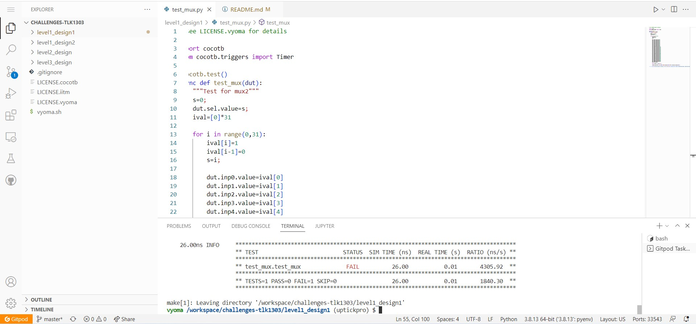

# Level1_Design1 MUX Verification

The verification environment is setup using [Vyoma's UpTickPro](https://vyomasystems.com) provided for the hackathon.



## Verification Environment

The [CoCoTb](https://www.cocotb.org/) based Python test is developed as explained. 

The test drives inputs to the Design Under Test (mux module) which takes in 31 inputs from inp0 to inp30, along with a 5-bit select input sel and gives an output *out*

The values are assigned to the input port using 
```
dut.sel.value   = 12
dut.inp12.value = 1
```

The assert statement is used for comparing the mux's output to the expected value.

The following error is seen:
```
assert dut.out.value == ival[i], "Test failed with: {S} {Ival} != {Out}".format(Ival=ival[i], S=dut.sel.value, Out=dut.out.value)
                     AssertionError: Test failed with: 01100 1 != 00
```
## Test Scenario-1 
- Test Inputs: inp12=1 sel=12
- Expected Output: out=1
- Observed Output in the DUT dut.out=0

Output mismatches for the above inputs as inp12 is 1 and when sel is 12 expected output is the value in inp12. 
Therefore this proves that there is a design bug

## Design Bug-1
Based on the above test input and analysing the design, we see the following

```
 begin
    case(sel)
    5'b01101: out = inp12;           ====> BUG
    endcase
  end

```
For a proper mux design, the case should be ``5'b01100: out = inp12`` instead of ``5'b01101: out = inp12`` as in the design code. As this statement connects inp12 to out when ``sel = 13``, and there is no case for ``sel=12``. Therefore the output comes from a default case.

## Design Fix-1
The design fix here must include a case where ``sel=12`` and connect inp12 to out when ``sel=12``.
Updating the design and re-running the test makes the test pass for this case.

```
5'b01100: out = inp12;
```

```
26.00ns INFO     sel=00012 model=1 DUT=1
```


## Verification Strategy

## Is the verification complete ?
