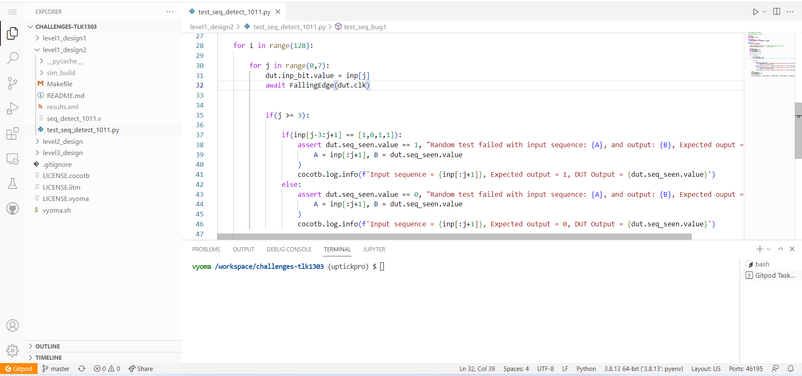

# Level1_Design2  SEQUENCE DETECTOR Verification

The verification environment is setup using [Vyoma's UpTickPro](https://vyomasystems.com) provided for the hackathon.



## Verification Environment

The [CoCoTb](https://www.cocotb.org/) based Python test is developed as explained. 

The test drives inputs to the Design Under Test (sequence detector module - seq_detect_1011.v) which takes a Clock, Reset and Input bit signal as its inputs. The Design Under Test(DUT) drives an output *seq_seen* whenever the sequence *1011* is detected. The Sequence detection should includes overlapping sequences of *1011*.

The Minimum constraint the DUT has to satisfy is, to detect the sequence *1011*. The Maximum constraint for sequence detector is, to detect the two consecutive sequence *10111011*. Therfore by checking the output for all possible 8-bit sequence the Design can be verified for all possible input sequences. The Test starts with a constraint input sequence and verifies the output. Then a radomized 8-bit sequence is applied to the input of DUT and its output is verified. The randomized input is applied for an appropriate number of times to cover all possible cases(2^8 = 256).

The Clock Input is driven using the cocotb.clock module whose period is specified by the following statements,
```
clock = Clock(dut.clk, 10, units="us")  # Create a 10us period clock on port clk
cocotb.start_soon(clock.start())        # Start the clock
```

The DUT is reset to its *IDLE* state before driving the input sequence. This is done by the stimulating the reset signal as given below,
```
dut.reset.value = 1
await FallingEdge(dut.clk)  
dut.reset.value = 0
await FallingEdge(dut.clk)
```
To Reset the sequence detector the Reset signal value is set *HIGH* till a falling edge of the clock is seen. Then the Reset signal is set to *LOW*, and the test waits for the next falling edge before proceeding with the test.

The Input sequence is stored in a list inp and driven to the *inp_bit* for a Clock period between two falling edges of the clock.
```
dut.inp_bit.value = inp[j]
await FallingEdge(dut.clk)
```
Before the next randomized 8-bit input sequence is applied the sequence detector is reset by using the following reset signal,
```
dut.reset.value = 1
await FallingEdge(dut.clk)  
dut.reset.value = 0
```

The assert statement is used for comparing the Sequence detector's output to the expected output. That is the DUT output must remain *LOW* while the sequence is not seen and The DUT output must be driven *HIGH* when the sequence is seen. Since the detecor's output must give correct values for both cases an if else condition is used.
```
if(inp[j-3:j+1] == [1,0,1,1]):
  assert dut.seq_seen.value == 1, "Random test failed with input sequence: {A}, and output: {B}, Expected ouput = 1".format(
                        A = inp[:j+1], B = dut.seq_seen.value
                    )
  cocotb.log.info(f'Input sequence = {inp[:j+1]}, Expected output = 1, DUT Output = {dut.seq_seen.value}')
else:
  assert dut.seq_seen.value == 0, "Random test failed with input sequence: {A}, and output: {B}, Expected ouput = 0".format(
                        A = inp[:j+1], B = dut.seq_seen.value
                    )
  cocotb.log.info(f'Input sequence = {inp[:j+1]}, Expected output = 0, DUT Output = {dut.seq_seen.value}')
```

In the above mentioned verfication environment, The following error is seen:

```
assert dut.seq_seen.value == 1, "Random test failed with input sequence: {A}, and output: {B}, Expected ouput = 1".format(
                      AssertionError: Random test failed with input sequence: [0, 1, 0, 1, 0, 1, 1], and output: 0, Expected ouput = 1
```
## Test Scenario-1 
- Test Inputs               : Input sequence     = 0, 1, 0, 1, 0, 1, 1
- Expected Output           : dut.seq_seen.value = 1
- Observed Output in the DUT: dut.seq_seen.value = 0

The Output of the Sequence detector mismatches because the last 4 inputs in the above sequence is *1011*. Hence the Expected output of the detector is 1. 
However the Observed output of the detector is a 0, indicating that the Detector has not been able to detect the sequence.

## Design Bug-1
Based on the above test input and analysing the design, we see the following

```
 always @(inp_bit or current_state)
  begin
    case(current_state)
    SEQ_101:
      begin
        if(inp_bit == 1)
          next_state = SEQ_1011;
        else
          next_state = IDLE;    =======>DESIGN BUG
    end
    endcase
  end

```
In the next state block, when current state is *SEQ_101* and Input is a *0* the design incorrectly moves to the *IDLE* state. This causes the error seen here where the Input sequence first gives *1 0 1* followed by a *0*. This moves the next state to *IDLE* and at the rising edge of clock, The current state changes to *IDLE*. 

## Design Fix-1
For proper functioning of detector the next state here should *SEQ_10*. Since the after the sequence *101* a *0* is encounterd, the last two inputs (*10* of *1010*) can be the First two bits of the required sequence(*1011*). Therefore the change in design here is,
```
SEQ_101:
      begin
        if(inp_bit == 1)
          next_state = SEQ_1011;
        else
          next_state = SEQ_10;
      end
```

Updating the design, along with changing the initial test input sequence to ```inp = [0, 1, 0, 1, 0, 1, 1, 0]``` and then re-running the test makes the test case pass,

```
 85000.00ns INFO     Input sequence = [0, 1, 0, 1, 0, 1, 1], Expected output = 1, DUT Output = 1
```


Then The second error is seen:
```
assert dut.seq_seen.value == 1, "Random test failed with input sequence: {A}, and output: {B}, Expected ouput = 1".format(
                     AssertionError: Random test failed with input sequence: [1, 1, 0, 1, 1], and output: 0, Expected ouput = 1
```
## Test Scenario-2
- Test Inputs               : Input sequence     = 1, 1, 0, 1, 1
- Expected Output           : dut.seq_seen.value = 1
- Observed Output in the DUT: dut.seq_seen.value = 0

The Output of the Sequence detector mismatches because the last 4 inputs in the above sequence is *1011*. Hence the Expected output of the detector is 1. 
However the Observed output of the detector is a 0, indicating that the Detector has not been able to detect the sequence here.

## Design Bug-2
Based on the above test input and analysing the design, we see the following

```
 always @(inp_bit or current_state)
  begin
    case(current_state)
    SEQ_1:
      begin
        if(inp_bit == 1)
          next_state = IDLE;  ======>DESIGN BUG
        else
          next_state = SEQ_10;
     end
    endcase
  end
```
Here when the input sequence has consecutive *1* the detector incorrectly moves the next state to *IDLE*. This means that the *1011* sequence beginning with the latter *1* is not detected as the Current state is *IDLE* and the following *0* does not cause any change in state.

## Design Fix-2
Here the detector must remain in *SEQ_1* state, so that if the next input is *0* it can move to the *SEQ_10* state. This ensures proper functioning of the Detector.
```
SEQ_1:
      begin
        if(inp_bit == 1)
          next_state = SEQ_1; 
        else
          next_state = SEQ_10;
     end
```

Updating the design, along with changing the initial test input sequence to ```inp = [1, 1, 0, 1, 1, 0, 0, 0]``` and then re-running the test makes the test case pass,

```
 65000.00ns INFO     Input sequence = [1, 1, 0, 1, 1], Expected output = 1, DUT Output = 1
```

Then a Third Error is encounterd: 
```
assert dut.seq_seen.value == 1, "Random test failed with input sequence: {A}, and output: {B}, Expected ouput = 1".format(
                     AssertionError: Random test failed with input sequence: [1, 0, 1, 1, 1, 0, 1, 1], and output: 0, Expected ouput = 1
```

## Test Scenario-3
- Test Inputs               : Input sequence     = 1, 0, 1, 1, 1, 0, 1, 1
- Expected Output           : dut.seq_seen.value = 1
- Observed Output in the DUT: dut.seq_seen.value = 0

Here two consecutive *1011* sequence is driven as input to the detector. The First sequence has been detected Correctly. However the second sequence was not detected. Hence it shows a bug in the design.

## Design Bug-3
Based on the above test input and analysing the design, we see the following

```
 always @(inp_bit or current_state)
  begin
    case(current_state)
    SEQ_1011:
      begin
        next_state = IDLE;  =====>DESIGN BUG
      end
    endcase
  end
```
Here After the Sequence is detected here and the seq_seen is driven *HIGH*, The next state of detector is always moved to *IDLE*. 

## Design Fix-3
Here the detector must remain in *SEQ_1* state, so that if the next input is *0* it can move to the *SEQ_10* state. This ensures proper functioning of the Detector.
```
SEQ_1:
      begin
        if(inp_bit == 1)
          next_state = SEQ_1; 
        else
          next_state = SEQ_10;
     end
```

Updating the design, along with changing the initial test input sequence to ```inp = [1, 1, 0, 1, 1, 0, 0]``` and then re-running the test makes the test case pass,

```
 65000.00ns INFO     Input sequence = [1, 1, 0, 1, 1], Expected output = 1, DUT Output = 1
```


## Verification Strategy
  The Verification strategy followed was to stimulate a single input line to logic HIGH and keep all other input lines at logic LOW. At the same time each input line was selected one after the other by using the select line. The corresponding observed outputs were checked against the expected output and mismatches were logged. 

## Is the verification complete ?
  The Verification for the given mux is complete and the design bugs were identified and fixed. The fixed design has passed all the test cases.
