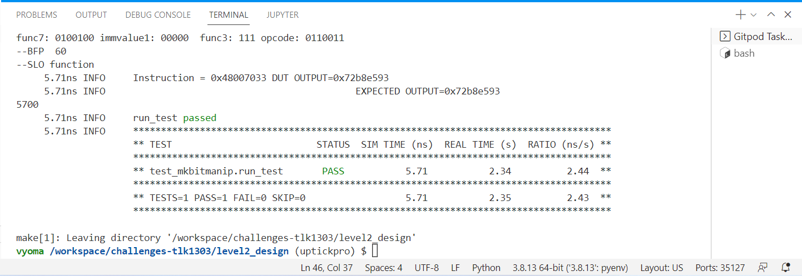

# Level2_Design BIT MANIPULATION CO-PROCESSOR Verification

The verification environment is setup using [Vyoma's UpTickPro](https://vyomasystems.com) provided for the hackathon. The Given Bit Manipulation Co-Processor is verified using the following Verification Environment.


## Verification Environment

The [CoCoTb](https://www.cocotb.org/) based Python test is developed as explained. 

The Hexadecimal values of the Instruction set of the processor is first stored in a list called *instr*. Each data input of the processor is driven by a random number generated using python random module. For a randomly generated set of three 32-bit input Each instruction of the processor is passed to the Instruction register of the processor, in consecutive clock cycles. Each output from the processor is simultaneously verified by a python model of the processor. The Random data is generated for sufficient number of times to cover all possible input corner cases. Whenever there is mismatch between output of the Design Under Test(DUT) output and the python model, the test failure signal is asserted and the test stops.

The values are assigned to the input port using 
```
a = random.randint(0, 2**32)
b = random.randint(0, 2**32)
c = random.randint(0, 2**32)

mav_putvalue_src1 = a
mav_putvalue_src2 = b
mav_putvalue_src3 = c

dut.mav_putvalue_src1.value = mav_putvalue_src1
dut.mav_putvalue_src2.value = mav_putvalue_src2
dut.mav_putvalue_src3.value = mav_putvalue_src3
dut.EN_mav_putvalue.value = 1
```

The Instruction set of the processor is stored in a list of hexadecimal values as,
```
instr = [   0x40007033,0x40006033, 0x40004033, 0x20001033, 0x20005033, 0x60001033, 0x60005033, 0x20002033, 0x20004033, 0x20006033,
            0x48001033, 0x28001033, 0x68001033, 0x48005033, 0x28005033, 0x68005033,0x06001033, 0x06005033, 0x04001033, 0x04005033,
            0x60001013, 0x60101013, 0x60201013, 0x60401013, 0x60501013, 0x61001013, 0x61101013, 0x61201013, 0x61801013, 0x61901013,
            0x61A01013, 0x0A001033, 0x0A003033, 0x0A002033, 0x0A004033, 0x0A005033, 0x0A006033, 0x0A007033, 0x48006033, 0x08006033,
            0x08004033, 0x48004033,                         0x08007033, 0x20001013, 0x20005013, 0x60005013, 0x48001013, 0x28001013, 
            0x68001013, 0x48005013, 0x08001033, 0x08005033, 0x08001013, 0x08005013, 0x28005013, 0x68005013, 0x04005013, 0x48007033]
            
mav_putvalue_instr = instr[j]    #Driving Instruction input  
```
The Python model file is used to obtain the expected output and the following assert statement is used for comparing the obtained output to the expected value.
```
dut_output = dut.mav_putvalue.value
expected_mav_putvalue = bitmanip(mav_putvalue_instr, mav_putvalue_src1, mav_putvalue_src2, mav_putvalue_src3)    

assert dut_output == expected_mav_putvalue, error_message
```

## Bugs Found
The following error is seen:
```
AssertionError: Input_Instruction = 01000000000000000111000000110011, Input data: SRC1 = 0xbf0b5d01, SRC2 = 0xde98a1fa, SRC3 = 0x92c482a5, Value mismatch DUT = 0x13c100201 does not match MODEL = 0x4206b803
```
## Test Scenario-1 
- Test Inputs           : INSTR=01000000000000000111000000110011
-                         SRC1 =0xbf0b5d01
-                         SRC2 =0xde98a1fa
-                         SRC3 =0x92c482a5            
- Expected Output       : 0x4206b803
- Observed Output       : 0x13c100201

The DUT output does not match the output from the model processor. 
Using the cocotb.log function the Instruction is obtained.
```
--ANDN 1
     0.01ns INFO     Instruction = 0x40007033 DUT OUTPUT=0x13c100201
     0.01ns INFO                         EXPECTED OUTPUT=0x4206b803
```
The Instruction which fails the test is found to be *ANDN 1*.
By running the Verification without the *ANDN 1* instruction value *0x40007033* in the *instr* list, all other instructions work correctly and the output is obtained as,


## Design Bug-1
By reading the Model file and comparing it with DUT file, The following seems to be the bug,

```
  assign x__h39889 = mav_putvalue_src1 & mav_putvalue_src2 ; ======>BUG Line=3911
```
In the model file the implementation is done as follows for *ANDN 1*,
```
if((func7 == "0100000") and (func3 == "111") and (opcode == "0110011") ):
        print('--ANDN 1')
        mav_putvalue=mav_putvalue_src1 & (~mav_putvalue_src2) =====>EXPECTED OPERATION
        mav_putvalue=mav_putvalue & 0xffffffff
        mav_putvalue=(mav_putvalue<<1)|1
        return mav_putvalue

```
## Design Fix-1
Based on the above observation the given buggy design was fixed with two changes,
```
  assign x__h39889 = mav_putvalue_src1 & ~mav_putvalue_src2 ;       //===>BUG FIX Line-3911
```
Fixing it as done above gave rise to a second error with instruction *CMIX  17*,So the second fix was done at line 2728 as
```
  assign field1__h2958 = (mav_putvalue_src1 & mav_putvalue_src2) | y__h39890 ;
```

Updating the design and re-running the test makes the test pass for all test cases.

```
SRC1= 3330864303  SRC2= 753667008  SRC3= 1108687512
func7: 0100000 immvalue1: 00000  func3: 111 opcode: 0110011 
--ANDN 1
     5.70ns INFO     Instruction = 0x40007033 DUT OUTPUT=0x18401e85f
     5.70ns INFO                         EXPECTED OUTPUT=0x18401e85f
```


The Corrected Design is stored in the name of *Corrected_proc.v* in the given repository.
The final output from the Verification after design fix was,
```
5800
     5.81ns INFO     run_test passed
     5.81ns INFO     **************************************************************************************
                     ** TEST                          STATUS  SIM TIME (ns)  REAL TIME (s)  RATIO (ns/s) **
                     **************************************************************************************
                     ** test_mkbitmanip.run_test       PASS           5.81           2.77          2.10  **
                     **************************************************************************************
                     ** TESTS=1 PASS=1 FAIL=0 SKIP=0                  5.81           2.78          2.09  **
                     **************************************************************************************
```
## Verification Strategy
  The Verification was done with a Randomized test strategy. Large number of random inputs over the whole range of 32 bits were generated and passed to the Bit Manipulation Co-Processor. For Each set of input the all instructions from the instruction set of the Processor was passed as input and the output of DUT was checked against the output from the Model Python file. 

## Is the verification complete ?
  The Verification was done for a large number of random inputs against all instructions of the Processor and no Fail cases were reported after the Bug Fixes. Hence the Verification of the Bit Manipulation Co-Processor is Complete.
  
