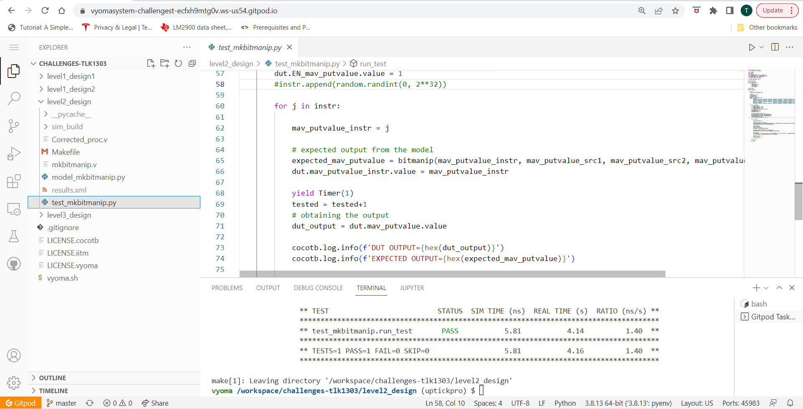

# Level2_Design BIT MANIPULATION CO-PROCESSOR Verification

The verification environment is setup using [Vyoma's UpTickPro](https://vyomasystems.com) provided for the hackathon. The Given Bit Manipulation Co-Processor is verified using the following Verification Environment.



## Verification Environment

The [CoCoTb](https://www.cocotb.org/) based Python test is developed as explained. 

The Hexadecimal values of the Instruction set of the processor is first stored in a list called *instr*. Each data input of the processor is driven by a random number generated using python random module. For a randomly generated set of three 32-bit input Each instruction of the processor is passed to the Instruction register of the processor, in consecutive clock cycles. Each output from the processor is simultaneously verified by a python model of the processor. The Random data is generated for sufficient number of times to cover all possible input corner cases. Whenever there is mismatch between output of the Design Under Test(DUT) output and the python model, the test failure signal is asserted and the test stops.

The values are assigned to the input port using 
```
a = random.randint(0, 2**32)
b = random.randint(0, 2**32)
c = random.randint(0, 2**32)

mav_putvalue_src1 = a
mav_putvalue_src2 = b
mav_putvalue_src3 = c

dut.mav_putvalue_src1.value = mav_putvalue_src1
dut.mav_putvalue_src2.value = mav_putvalue_src2
dut.mav_putvalue_src3.value = mav_putvalue_src3
dut.EN_mav_putvalue.value = 1
```

The Instruction set of the processor is stored in a list of hexadecimal values as,
```
instr = [   0x40007033,0x40006033, 0x40004033, 0x20001033, 0x20005033, 0x60001033, 0x60005033, 0x20002033, 0x20004033, 0x20006033,
            0x48001033, 0x28001033, 0x68001033, 0x48005033, 0x28005033, 0x68005033,0x06001033, 0x06005033, 0x04001033, 0x04005033,
            0x60001013, 0x60101013, 0x60201013, 0x60401013, 0x60501013, 0x61001013, 0x61101013, 0x61201013, 0x61801013, 0x61901013,
            0x61A01013, 0x0A001033, 0x0A003033, 0x0A002033, 0x0A004033, 0x0A005033, 0x0A006033, 0x0A007033, 0x48006033, 0x08006033,
            0x08004033, 0x48004033,                         0x08007033, 0x20001013, 0x20005013, 0x60005013, 0x48001013, 0x28001013, 
            0x68001013, 0x48005013, 0x08001033, 0x08005033, 0x08001013, 0x08005013, 0x28005013, 0x68005013, 0x04005013, 0x48007033]
            
mav_putvalue_instr = instr[j]    #Driving Instruction input  
```
The Python model file is used to obtain the expected output and the following assert statement is used for comparing the obtained output to the expected value.
```
dut_output = dut.mav_putvalue.value
expected_mav_putvalue = bitmanip(mav_putvalue_instr, mav_putvalue_src1, mav_putvalue_src2, mav_putvalue_src3)    

assert dut_output == expected_mav_putvalue, error_message
```

## Bugs Found
The following error is seen:
```

```
## Test Scenario-1 
- Test Inputs: inp12=1 sel=12
- Expected Output: out=1
- Observed Output in the DUT dut.out=0

Output mismatches for the above inputs as inp12 is 1 and when sel is 12 expected output is the value in inp12. 
Therefore this proves that there is a design bug

## Design Bug-1
Based on the above test input and analysing the design, we see the following

```
 begin
    case(sel)
    5'b01101: out = inp12;           ====> BUG
    5'b01101: out = inp13;
    endcase
  end

```
For a proper mux design, the case should be ``5'b01100: out = inp12`` instead of ``5'b01101: out = inp12`` as in the design code. This statement connects inp12 to out when ``sel = 13``, and there is no case for ``sel=12``. Therefore the output comes from a default case.

## Design Fix-1
The design fix here must include a case where ``sel=12`` and connect inp12 to out when ``sel=12``.
```
5'b01100: out = inp12;
```

Updating the design and re-running the test makes the test pass for this case.

```
770.00ns INFO     sel=00012 model=1 DUT=1
```


Then The second error is seen:
```
assert dut.out.value == ival[i], "Test failed with: {S} {Ival} != {Out}".format(Ival=ival[i], S=dut.sel.value, Out=dut.out.value)
                     AssertionError: Test failed with: 11110 1 != 00
```
## Test Scenario-2
- Test Inputs: inp30=1 sel=30
- Expected Output: out=1
- Observed Output in the DUT dut.out=0

Output mismatches for the above inputs as inp30 is 1 and when sel is 30 expected output is the value in inp30. 
Therefore this proves that there is a design bug

## Design Bug-2
Based on the above test input and analysing the design, we see the following

```
 begin
    case(sel)
    5'b11101: out = inp29;   ====> BUG
    default: out = 0;
    endcase
  end

```
The given mux design does not have a case for ``sel=30`` that is ``sel=5'b11110``. Therefore the mux design gives a default case output of 0 while the expected output for ``sel=30`` is 1.

## Design Fix-2
The design fix here must include a case where ``sel=30`` and connect inp30 to out when ``sel=30``.
```
5'b11110: out = inp30;
```

Updating the design and re-running the test makes the test pass for this case.


The Corrected Design is added in The Corrected design directory of this repository.
## Verification Strategy
  The Verification strategy followed was to stimulate a single input line to logic HIGH and keep all other input lines at logic LOW. At the same time each input line was selected one after the other by using the select line. The corresponding observed outputs were checked against the expected output and mismatches were logged. 

## Is the verification complete ?
  The Verification for the given mux is complete and the design bugs were identified and fixed. The fixed design has passed all the test cases.
