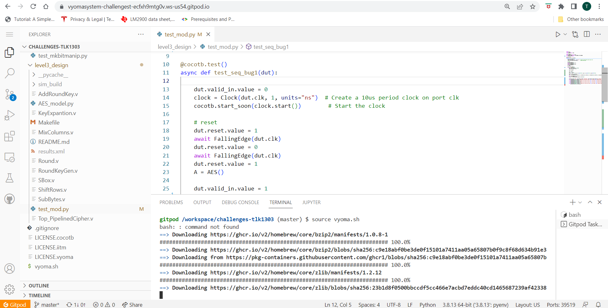
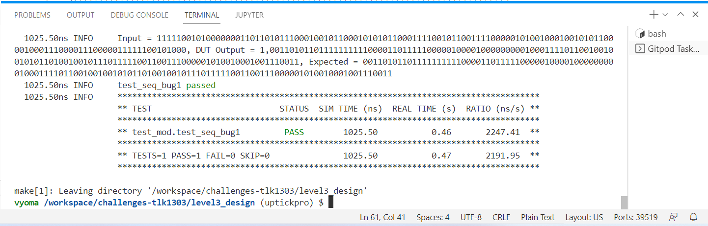

# Level1_Design2  SEQUENCE DETECTOR Verification

The verification environment is setup using [Vyoma's UpTickPro](https://vyomasystems.com) provided for the hackathon. The Design chosen for this level of Hackathon is the AES-128 Crypto-Core. The AES-128 encrypts a 128-bit input by passing the input through 10 rounds of Encryption. Each Round consists of the same set of blocks, which are implemented as separate modules in the Design RTL file. So The functional verification of AES-128 can be done by doing a block-wise/module-wise verification.
For the purpose of the Hackathon, The MixColumns module of the Design is verified. 



## Verification Environment

The [CoCoTb](https://www.cocotb.org/) based Python test is developed as explained. 

The Verification Environment drives the each input of the MixColumns module(DUT) by appropriate values. Necessary Clock and Reset signlas are driven to the module for its verfication. The Data input is generated randomly for a sufficiently large number of times and driven to the Data input of the module. The data valid line is verified first and then set to *HIGH* to get the MixColumns output. An open-source AES python class is used to get the model file for each block of the AES-128 design. The random inputs driven to the MixColumns module are also used as input to mixcolumns routine of the AES model class. The output from the model file is verfied against the output from the Design Under Test(DUT).

The Clock Input is driven using the cocotb.clock module whose period is specified by the following statements,
```
clock = Clock(dut.clk, 10, units="us")  # Create a 10us period clock on port clk
cocotb.start_soon(clock.start())        # Start the clock
```

The DUT is reset before the inputs are driven,
```
dut.reset.value = 1
await FallingEdge(dut.clk)  
dut.reset.value = 0
await FallingEdge(dut.clk)
```
To Reset the DUT the Reset signal value is set *HIGH* till a falling edge of the clock is seen. Then the Reset signal is set to *LOW*, and the test waits for the next falling edge before proceeding with the test.

The Input to the DUT is randomly generated and driven to data_in input line,
```
inp = random.randint(0, 2**128)
dut.data_in.value = inp
```
The same input is divided into four 32-bit sequence and passed to the model AES mixcolumns function,
```
inp = bin(inp)
inp = inp[2:]
inp = int(inp,2)
block = [inp >> 96, inp >> 64 & 0xffffffff, inp >> 32 & 0xffffffff, inp & 0xffffffff]
       
out1 = A.mixcolumns(block)
```
The output from the function is stored in the *out1* variable. The value in *out1* variable is compared woth the actual output from the DUT using the assert statements

```
dut_out = bin(dut.data_out.value)[2:].zfill(128)

cocotb.log.info(f'Input = {dut.data_in.value}, DUT Output = {dut.valid_out.value},{dut_out}, Expected = {out1[0]}{out1[1]}{out1[2]}{out1[3]}')            
assert dut_out[0:32] == out1[0] , "Random test failed with input: {A}, and output: {B}, Expected ouput = {C} in Word = 1".format(
            A=inp,B=dut_out[0:32],C=out1[0])
assert dut_out[32:64] == out1[1] , "Random test failed with input: {A}, and output: {B}, Expected ouput = {C} in Word = 2".format(
            A=inp,B=dut_out[32:64],C=out1[1])
assert dut_out[64:96] == out1[2] , "Random test failed with input: {A}, and output: {B}, Expected ouput = {C} in Word = 3".format(
            A=inp,B=dut_out[64:96],C=out1[2])
assert dut_out[96:128] == out1[3] , "Random test failed with input: {A}, and output: {B}, Expected ouput = {C} in Word = 4".format(
            A=inp,B=dut_out[96:128],C=out1[3])
```
The output from DUT is stored in *DUT_OUT* variable. The assert statement is used to identify the error in one of the four 32-bit Words.

## ERRORS IN DUT
In the above mentioned verfication environment, The following error is seen:

```
assert dut_out[32:64] == out1[1] , "Random test failed with input: {A}, and output: {B}, Expected ouput = {C} in Word = 1".format(
                     AssertionError: Random test failed with input: 77444025260058953180764184109615742822, and output: 11101111101100010010100110110111, Expected    ouput = 11101100101100010010100110110111 in Word = 2
```
## Test Scenario-1 
- Test Inputs               : 77444025260058953180764184109615742822
- Expected Output           : 11101100101100010010100110110111
- Observed Output in the DUT: 11101111101100010010100110110111
- Word Number               : 2

The Assert statement clearly mentions that an error is found in Word-2. That is in the second 32-bit word of the output. The DUT is implemented as collection of operations on four 32-bit words. Therefore Operations on the Second 32-bit word is verified to find the design bug.

## Design Bug-1
Checking the operations on the Second 32-bit word the following Design Bug is found,

```
    data_out[(11*8)+7:(11*8)]<= State_Mulx2[4] ^ State_Mulx2[5] ^ State[6] ^ State[7];   //second column ======>DESIGN BUG
    data_out[(10*8)+7:(10*8)]<= State[4] ^ State_Mulx2[5] ^ State_Mulx3[6] ^ State[7];
    data_out[(9*8)+7:(9*8)] <=  State[4] ^ State[5] ^ State_Mulx2[6] ^ State_Mulx3[7]; 
    data_out[(8*8)+7:(8*8)]<= State_Mulx3[4] ^ State[5] ^ State[6] ^ State_Mulx2[7];

```
As per the AES specification THe State-5 should have been multiplied by 3 instead of 2, which is done here.
```
State_Mulx2[4] ^ State_Mulx2[5] ^ State[6] ^ State[7];
```

## Design Fix-1
For proper functioning of DUT the *State_Mulx2[5]* is changed as *State_Mulx3[5]*. 
```
data_out[(11*8)+7:(11*8)]<= State_Mulx2[4] ^ State_Mulx3[5] ^ State[6] ^ State[7];   //second column
```


Updating the design, and rerunning the test another error in DUT is found,
```
assert dut_out[64:96] == out1[2] , "Random test failed with input: {A}, and output: {B}, Expected ouput = {C} in Word = 3".format(
                     AssertionError: Random test failed with input: 102964276406082905540204933244725949758, and output: 11001011111111101000001010111011, Expected ouput = 11001011000100001000001010111011 in Word = 3
```

## Test Scenario-2
- Test Inputs               : 102964276406082905540204933244725949758
- Expected Output           : 11001011000100001000001010111011
- Observed Output in the DUT: 11001011111111101000001010111011
- Word Number               : 3

The Assesrt statement here points to an error in the word-3. Therefore the third 32-bit word's operations are checked.

## Design Bug-2
Based on the analysis of operations on third 32-bit word the following Design Bug is found,

```
    data_out[(7*8)+7:(7*8)]<= State_Mulx2[8] ^ State_Mulx3[9] ^ State[10] ^ State[11];   //third column
    data_out[(6*8)+7:(6*8)]<= State[8] & State_Mulx2[9] ^ State_Mulx3[10] ^ State[11];   ================>BUG
    data_out[(5*8)+7:(5*8)]<= State[8] ^ State[9] ^ State_Mulx2[10] ^ State_Mulx3[11]; 
    data_out[(4*8)+7:(4*8)]<= State_Mulx3[8] ^ State[9] ^ State[10] ^ State_Mulx2[11];
```
Here the *State[8]* byte and *State_Mul2[9]* byte are *AND*ed. As per the AES speicfication the correct operation is *XOR*.
```
 State[8] & State_Mulx2[9] ^ State_Mulx3[10] ^ State[11];
```

## Design Fix-2
To fix the Bug The *AND* Operation is replaced with *XOR* operation,
```
data_out[(6*8)+7:(6*8)]<= State[8] ^ State_Mulx2[9] ^ State_Mulx3[10] ^ State[11];
```

Following these design fixes the DUT performed correct operation on all random test cases,
 
 
 
Both Fixed Design and Buggy design are added in the repository.
## Verification Strategy
  The Verification strategy followed was a Block wise verification with randomised inputs. An Open source Model AES python file was used to get correct outputs. This was tested against the output from Design Under Test for a sufficiently large number of random inputs.

## Is the verification complete ?
  The Verification Environment tested a variety of Inputs for the given module. The Output from each of the four 32-bit words were repeatedly check against the expected output for random inputs. The Test properly threw two fail cases during Verification. Upon Correcting there has been no fail cases. Hence the Verifiaction of this Module is Complete.
